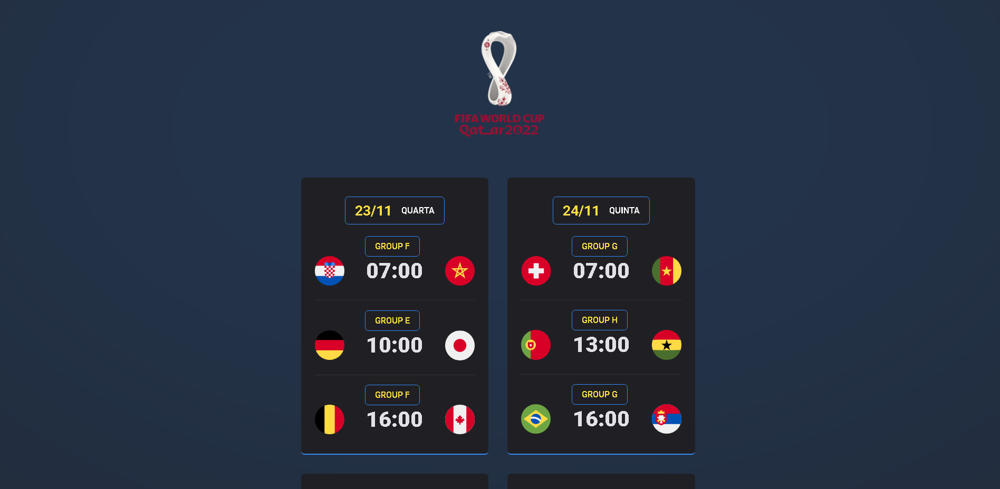

<h1 aling="center">NLW #10 Copa</h1>

    <a href="#tecnologias">Tecnologias</a>&nbsp; &nbsp; &nbsp; | &nbsp; &nbsp; &nbsp;
    <a href="#projeto">Projeto</a>&nbsp; &nbsp; &nbsp; | &nbsp; &nbsp; &nbsp;
    <a href="#layout">Layout</a>&nbsp; &nbsp; &nbsp; | &nbsp; &nbsp; &nbsp;
    <a href="#memo-licença">Licença</a>

    

 

    

## Tecnologias

Esse projeto foi desenvolvido com as seguintes tecnologias:

- HTML e CSS
- JavaScript 
- Git e Github

## Projeto

O Calendário da Copa é um projeto que mostras as possiveis partidas mais emocionantes da fase de grupos da Copa do Qatar 2022.

## Layout

Você pode visualizar o layout do projeto através [DESSE LINK](https://www.figma.com/file/EYM4SOU7bJpjcaaIBR2RW2/Calend%C3%A1rio-de-Jogos-(Community)?node-id=0%3A1). É nescessário ter conta no [FIGMA](https://www.figma.com) para acessá-lo.

## :memo: Licença

Esse projeto está sob a licença MIT.

---

Feito por Lucas Numeriano :wave: 